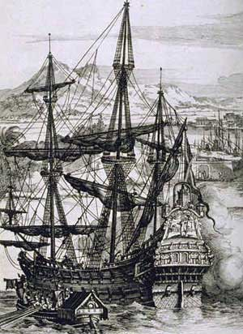
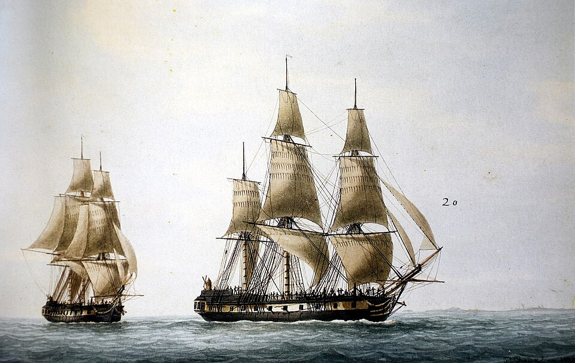
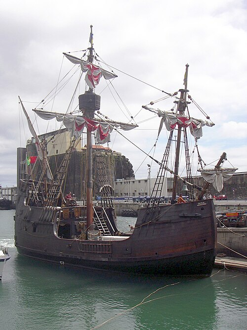
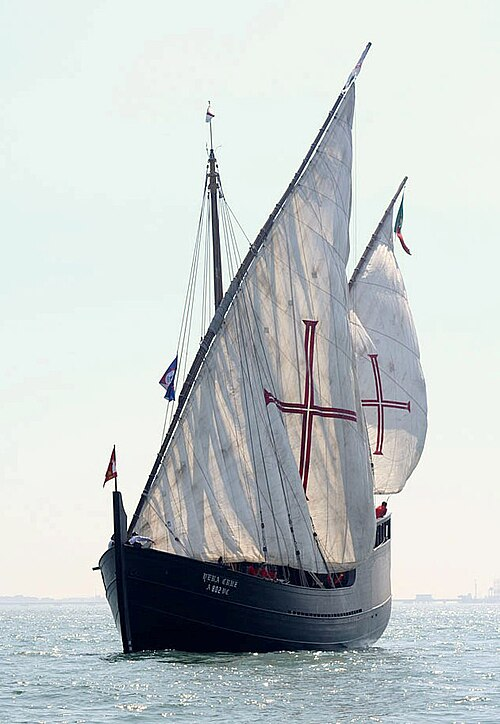
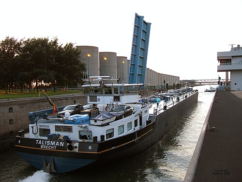

### Grupo: Amêijoas Alérgicas ETI

| Nome              | Número |
|:------------------|:-------|
| Henrique Catarino | 129799 |
| Rafael Assunção   | 129792 |
| Miguel Ferreira   | 122620 |

## ⚓ Tipos de navios

Nesta versão do jogo, a **Batalha Naval** passa-se no tempo das **Descobertas** (*Discoveries Battleship Game*), por isso os navios clássicos foram substituídos por embarcações da época dos Descobrimentos portugueses.

Cada jogador tem uma frota de **11 navios**, que ocupam **25 quadrados** da grelha de 10x10.

| Batalha Naval (clássica) | Descobrimentos | English | Dimensão (quadrados) | Nº de navios |
|--------------------------|----------------|---------|:--------------------:|:------------:|
| Porta-aviões             | Galeão         | Galleon |          5           |      1       |
| Navio de 4 canhões       | Fragata        | Frigate |          4           |      1       |
| Navio de 3 canhões       | Nau            | Carrack |          3           |      2       |
| Navio de 2 canhões       | Caravela       | Caravel |          2           |      3       |
| Submarino                | Barca          | Barge   |          1           |      4       |

## 📜 Enquadramento Histórico e Frotas dos Descobrimentos

Nesta versão temática da Batalha Naval, viajamos até à **Época dos Descobrimentos (séculos XV a XVII)**, período em que os navegadores portugueses desbravaram os oceanos desconhecidos. Abaixo podes conhecer mais sobre cada embarcação que compõe a nossa frota, acompanhada por referências e ligações diretas para a Wikipedia.

---

### 1. Galeão (Substitui o Porta-aviões)
* **Dimensão:** 5 quadrados
* **História:** O **galeão** foi um grande navio à vela desenvolvido na primeira metade do século XVI. Era amplamente utilizado tanto para o comércio de longa distância (como as frotas da Índia) quanto como navio de guerra devido à sua excelente capacidade de artilharia.
* **Wikipedia:** [Artigo sobre Galeão](https://pt.wikipedia.org/wiki/Gale%C3%A3o)
* **Fotografia/Ilustração:**
  

---

### 2. Fragata (Substitui o Navio de 4 canhões)
* **Dimensão:** 4 quadrados
* **História:** As **fragatas** originais da época moderna eram navios de guerra rápidos, manobráveis e com uma só coberta de bateria. Eram muito usadas para escolta, missões de reconhecimento e patrulhamento.
* **Wikipedia:** [Artigo sobre Fragata](https://pt.wikipedia.org/wiki/Fragata)
* **Fotografia/Ilustração:**
  

---

### 3. Nau (Substitui o Navio de 3 canhões)
* **Dimensão:** 3 quadrados
* **História:** A **nau** (ou carraca) foi o grande símbolo da expansão marítima portuguesa nos séculos XV e XVI. Navio robusto de alto bordo e três mastros, foi nele que Vasco da Gama chegou à Índia em 1497.
* **Wikipedia:** [Artigo sobre Nau](https://pt.wikipedia.org/wiki/Nau_(embarca%C3%A7%C3%A3o))
* **Fotografia/Ilustração:**
  

---

### 4. Caravela (Substitui o Navio de 2 canhões)
* **Dimensão:** 2 quadrados
* **História:** A **caravela** é talvez o navio mais icónico dos Descobrimentos portugueses. Com velas latinas e um casco leve, permitia navegar à bolina (contra o vento), tornando-se fundamental na exploração da costa ocidental africana.
* **Wikipedia:** [Artigo sobre Caravela](https://pt.wikipedia.org/wiki/Caravela)
* **Fotografia/Ilustração:**
  

---

### 5. Barca (Substitui o Submarino)
* **Dimensão:** 1 quadrado
* **História:** A **barca** era uma embarcação mais pequena e tradicional, utilizada inicialmente pelos navegadores portugueses no início da exploração da costa africana (passagem do Cabo Bojador) antes do desenvolvimento da caravela.
* **Wikipedia:** [Artigo sobre Barca (Embarcação)](https://pt.wikipedia.org/wiki/Barca_(embarca%C3%A7%C3%A3o))
* **Fotografia/Ilustração:**
  

## Regras do Jogo (Discoveries Battleship Game)

O jogo da Batalha Naval da época dos Descobrimentos segue a mecânica tradicional adaptada à estratégia de combate naval português:

### 1. Tabuleiros e Posicionamento Inicial
* Cada jogador dispõe de **duas grelhas quadriculadas de 10x10 quadrados** (linhas de 0 a 9 e colunas de 0 a 9):
  * **O seu mar:** onde posiciona a sua própria frota secretamente.
  * **O mar do adversário:** onde vai registando os tiros efetuados e os navios inimigos localizados/afundados.
* Cada frota é composta por **10 navios** (1 Galeão, 1 Fragata, 2 Naus, 3 Caravelas e 4 Barcas).
* Os navios podem ser orientados **horizontalmente ou verticalmente**.
* **Regra de contacto:** Os navios **não se podem tocar entre si** em nenhuma circunstância (nem em lados contíguos nem nas diagonais), embora possam encostar às margens e bordas da grelha.

### 2. Dinâmica de Combate e Disparos
* Os jogadores jogam à vez em turnos alternados.
* Na sua vez, o jogador efetua uma **rajada de três tiros**, indicando as respetivas coordenadas `(linha, coluna)` para cada disparo.
* O adversário verifica os impactos na sua grelha e anuncia o resultado completo da rajada:
  * **Água:** tiro que não atingiu qualquer embarcação.
  * **Tiro / Acerto:** tiro que danificou uma posição de um navio (indicando o tipo de navio atingido).
  * **Afundado:** quando todas as posições de um determinado navio foram atingidas.
* O jogador atacante anota esses resultados na sua grelha de exploração para planear as rajadas seguintes.

### 3. Condição de Vitória
* Vence a partida o primeiro jogador que conseguir **afundar a totalidade dos 10 navios** da frota adversária.
a


# ⚓ Discoveries Battleship Game

```
                 |    |    |
                )_)  )_)  )_)
               )___))___))___)\
              )____)____)_____)\\
            _____|____|____|____\\\__
   ---------\                   /---------
     ^^^^^^^^^^^^^^^^^^^^^^^^^^^^^^^^^^^^^
       ^^^^      ^^^^^^^     ^^^^     ^^^
```

> Do Tejo ao fim do mundo: leva a tua frota à vitória!

